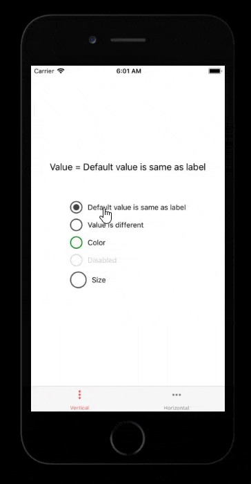

# React Native Radio Buttons Group

Simple, best and easy to use radio buttons for react native apps.

 

[](https://nodei.co/npm/react-native-radio-buttons-group/)

## Getting Started

###### Just a sneak peek (lots more can be done)



### Installation

```bash
npm i react-native-radio-buttons-group --save
```
or
```bash
yarn add react-native-radio-buttons-group
```

### Usage

##### JavaScript Example

###### App.js
```jsx
import React, { useMemo, useState } from 'react';
import RadioGroup from 'react-native-radio-buttons-group';

export default function App() {

    const radioButtons = useMemo(() => ([
        {
            id: '1', // acts as primary key, should be unique and non-empty string
            label: 'Option 1',
            value: 'option1'
        },
        {
            id: '2',
            label: 'Option 2',
            value: 'option2'
        }
    ]), []);

    const [selectedId, setSelectedId] = useState();

    return (
        <RadioGroup 
            radioButtons={radioButtons} 
            onPress={setSelectedId}
            selectedId={selectedId}
        />
    );

}

```

##### TypeScript Example

###### App.tsx
```tsx
import React, { useMemo, useState } from 'react';
import RadioGroup, {RadioButtonProps} from 'react-native-radio-buttons-group';

export default function App() {

    const radioButtons: RadioButtonProps[] = useMemo(() => ([
        {
            id: '1', // acts as primary key, should be unique and non-empty string
            label: 'Option 1',
            value: 'option1'
        },
        {
            id: '2',
            label: 'Option 2',
            value: 'option2'
        }
    ]), []);

    const [selectedId, setSelectedId] = useState<string | undefined>();

    return (
        <RadioGroup 
            radioButtons={radioButtons} 
            onPress={setSelectedId}
            selectedId={selectedId}
        />
    );

}

```

### Props

#### RadioButton
Key | Type | Required | Default | Valid Values
--- | --- | --- | --- | --- 
accessibilityLabel | string | no | Value of `label` | any string
borderColor | string | no | color | css color formats
borderSize | number | 2 | | positive numbers
color | string | no | #444 | css color formats
containerStyle | object | no | | react style
description | ReactNode or string | no |  | any react node or string
descriptionStyle | object | no |  | react style, applied only if `description` is a string
disabled | boolean | no | false | true / false
id | string | yes |  | unique string
label | ReactNode or string | no |  | any react node or string
labelStyle | object | no |  | react style, applied only if `label` is a string
layout | enum | no | row | row / column
onPress | function | no |  | any function 
selected | boolean | no | false | true / false
size | number | no | 24 | positive numbers
testID | string | no | | any string
value | string | no |  | any string

#### RadioGroup
Key | Type | Required | Default | Valid Values
--- | --- | --- | --- | ---
accessibilityLabel | string | no | | any string
containerStyle | object | no | | react style
labelStyle | object | no | | react style
layout | enum | no | column | row / column
onPress | function | no | | any function
radioButtons | array | yes | | array of [RadioButton](#radiobutton) objects
selectedId | string | no | | unique string
testID | string | no | | any string

###### Horizontal (side by side)
```jsx
<RadioGroup 
    radioButtons={radioButtons} 
    onPress={onPressRadioButton} 
    layout='row'
/>
```

## Contributions

Fork and create a pull request

## License

[MIT License](https://github.com/ThakurBallary/react-native-radio-buttons-group/blob/master/LICENSE)


## Stargazers over time 

[](https://starchart.cc/ThakurBallary/react-native-radio-buttons-group)

## Sponsor
<a href="https://www.buymeacoffee.com/thakurballary" target="_blank"></a>
