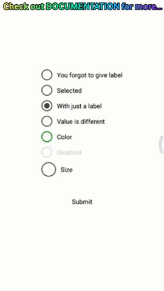

# React Native Radio Buttons Group

Simple and Best. An easy to use radio buttons for react native apps.


[](https://nodei.co/npm/react-native-radio-buttons-group/)

## Getting Started

###### Just a sneak peek (lots more can be done)

Suggestions are always Welcome



### Installation

```
npm i react-native-radio-buttons-group --save
```

### Usage

###### App.js
```
import React, { Component } from 'react';
import { Text, View, StyleSheet } from 'react-native';

import RadioGroup from 'react-native-radio-buttons-group';

export default class App extends Component {
  state = {
    // Below mention objects explains different props supported by radio button
    radioButtons: [
      {}, // empty object will create radio button with default values
      {
        label: 'Selected',
        selected: true,
      },
      {
        label: 'With just a label',
      },
      {
        label: 'Value is different',
        value: "I'm not same as label",
      },
      {
        label: 'Color',
        color: 'green',
      },
      {
        disabled: true,
        label: 'Disabled',
      },
      {
        label: 'Size',
        size: 32,
      },
      {
        label: 'Layout column',
        layout: 'column',
      },
    ],
  };

  // update state
  onPress = radioButtons => this.setState({ radioButtons });

  // output
  onSubmit = () => alert(this.state.radioButtons.find(e => e.selected == true).value);

  render() {
    return (
      <View style={styles.container}>
        <RadioGroup
          radioButtons={this.state.radioButtons}
          onPress={this.onPress}
        />
        <Text style={{ padding: 40, alignSelf: 'center' }} onPress={this.onSubmit}>Submit</Text>
      </View>
    );
  }
}

const styles = StyleSheet.create({
  container: {
    flex: 1,
    alignItems: 'center',
    justifyContent: 'center',
  },
});

```

### Default object of radio button
```
{
  color: '#444',
  disabled: false,
  label: 'You forgot to give label', // unique and not null
  layout: 'row',
  selected: false,
  size: 24,
  value: <label> // value is assigned to label
}
```

### Props
```
Props           Data Type       Valid Values
-----------------------------------------------------
color           String          < all css formats >
disabled        Boolean         true/false
label           String          
layout          String          row/column
selected        Boolen          true/false
size            Number          < positive numbers >
value           String          < mention value if you want to give different value other than 'label'>
```

## Contributing

Please read [CONTRIBUTING.md](https://gist.github.com/PurpleBooth/b24679402957c63ec426) for details on our code of conduct, and the process for submitting pull requests to us.

## License

This project is licensed under the [MIT License](https://github.com/ThakurBallary/react-native-radio-buttons-group/blob/master/LICENSE)
